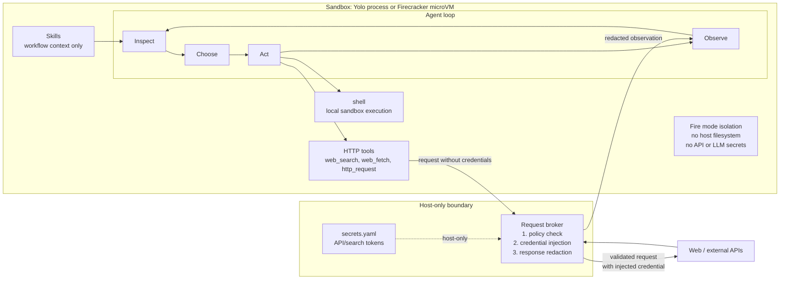

# Architecture

strangeClaw is built around a small host process, a sandboxed agent runtime, a
host-services layer, and a strict model-driven execution loop.

## Runtime Shape

The host owns adapters, session coordination, sandbox lifecycle, host-side
credentials, and host services. The sandbox owns the agent loop and enabled
tools. In Fire mode, the sandbox is a Firecracker microVM.

## Agentic Loop

The execution loop is strict:

1. Inspect: assemble task, plan, history, tools, integrations, and activated
   skill docs.
2. Choose: ask the model for exactly one structured decision.
3. Act: execute the selected tool or model-issued control action.
4. Observe: append the result to history and emit an action event.
5. Repeat: continue until the model chooses `agent_done`, `agent_clarify`, or
   `agent_replan`.

Free-form prose is not a valid execution decision. Completion is a structured
`agent_done` action. Runtime safety exits still exist for iteration limits,
transport shutdown, and sandbox failures.

## Execution Modes

`yolo` mode runs directly on the host. It is intended for trusted local
workflows and has no isolation.

`fire` mode runs the agent inside a Firecracker microVM. One VM runs per active
session, starts on the first task, and persists across follow-up tasks in that
session. Files and installed tooling persist within the session. Across
sessions, the guest filesystem starts fresh from a per-session rootfs copy.

## Adapters And Coordinator

Adapters own user interaction for a channel. The current adapters are CLI and
Telegram.

The coordinator owns session workers and sandbox lifecycle. A task worker drives
one task at a time, but it does not stop the session sandbox when a task
finishes. Fire sandboxes are stopped explicitly or by idle timeout.

## Tools

Tools are capabilities and form the permission boundary. They are built into the
framework and can be enabled or disabled in config:

- `shell`: run shell commands. High risk.
- `web_search`: search via the host broker. Low risk.
- `web_fetch`: fetch a public URL via the host broker. Low risk.
- `http_request`: make structured HTTP/API calls via the host broker. Medium
  risk.

Disabled tools are removed from the model's action surface.

`web_fetch` is a dumb pipe: the broker returns `status_code`, `headers`, decoded
UTF-8 `body`, and `truncated`. The host does not parse or summarize fetched
content.

## Skills

Skills are workflow context, not executable permissions. A skill is a directory
under `skills/` with `SKILL.md` frontmatter and optional `references/`,
`scripts/`, and `assets/` files.

Installing a skill grants no new access. Skills can only influence how the model
uses already-enabled tools. Bundled files are loaded on demand through
`agent_read_skill_file`; bundled scripts are only inert files until the model
uses the `shell` tool to run them.

## Host Services

Host services are request/response handlers reachable from the sandbox through
the existing event stream:

- `broker`: validates and executes HTTP/search/API tool calls.
- `llm`: handles Fire-mode model calls from the guest.

In Yolo mode, host-service calls are in-process. In Fire mode, they are
multiplexed over the same vsock JSONL stream as agent events.

## Credential Boundaries

External API/search credentials live in `~/.strangeclaw/secrets.yaml` and are
held by the host-side request broker. The model requests an integration by name;
the broker validates policy, injects credentials, executes the request, redacts
responses, and returns an observation.

In Fire mode, LLM provider credentials stay in the host process. The guest uses
`LLMProxyRuntime` to call the host-side `llm` service and does not receive
LiteLLM provider configuration or API keys.

## Sessions

Each session stores state under `~/.strangeclaw/sessions/<id>/`:

- `state.json`: redacted task state.
- `outputs/`: files exported from the sandbox.
- `events.jsonl`: optional redacted event journal.

Fire mode does not support `--resume` across sessions because guest filesystems
are ephemeral across sessions. Within a running Fire session, files persist
until the VM is stopped.
