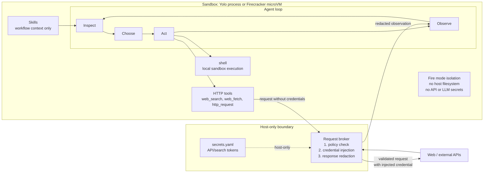

# Architecture

strangeClaw is built around a small host process, a sandboxed agent runtime, a
host-services layer, and a strict model-driven execution loop.

## Runtime Shape

The host owns adapters, session coordination, sandbox lifecycle, host-side
credentials, and host services. The sandbox owns the agent loop and enabled
tools. In Fire mode, the sandbox is a Firecracker microVM.

## Design Priorities

- Simplicity: a small Python codebase with explicit module boundaries.
- Security: the agent can run inside a Firecracker microVM; credentials stay on
  the host behind the request broker.
- Maintainability: tools are fixed runtime capabilities, skills are plain
  workflow documents.
- Expandability: adapters, skills, and host services can be added without
  changing the core loop.

## Agentic Loop

The execution loop is strict:

1. Inspect: assemble task, plan, history, tools, integrations, and activated
   skill docs.
2. Choose: ask the model for exactly one structured decision.
3. Act: execute the selected tool or model-issued control action.
4. Observe: append the result to history and emit an action event.
5. Repeat: continue until the model chooses `agent_done`, `agent_clarify`, or
   `agent_replan`.

Free-form prose is not a valid execution decision. Completion is a structured
`agent_done` action. Runtime safety exits still exist for iteration limits,
transport shutdown, and sandbox failures.

## Execution Modes

`yolo` mode runs directly on the host. It is intended for trusted local
workflows and has no isolation.

`fire` mode runs the agent inside a Firecracker microVM. One VM runs per active
session, starts on the first task, and persists across follow-up tasks in that
session. Files and installed tooling persist within the session. Across
sessions, the guest filesystem starts fresh from a per-session rootfs copy.

## Adapters And Coordinator

Adapters own user interaction for a channel. The current adapters are CLI and
Telegram.

The coordinator owns session workers and sandbox lifecycle. A task worker drives
one task at a time, but it does not stop the session sandbox when a task
finishes. Fire sandboxes are stopped explicitly or by idle timeout.

## Tools

Tools are capabilities and form the permission boundary. They are built into the
runtime and can be enabled or disabled in config:

- `shell`: run shell commands. High risk.
- `web_search`: search via the host broker. Low risk.
- `web_fetch`: fetch a public URL via the host broker. Low risk.
- `http_request`: make structured HTTP/API calls via the host broker. Medium
  risk.

Disabled tools are removed from the model's action surface.

`web_fetch` is intentionally a pass-through tool: the broker returns
`status_code`, `headers`, decoded UTF-8 `body`, and `truncated`. The host does
not parse or summarize fetched content.

## Skills

Skills are workflow context, not executable permissions. A skill is a directory
under `skills/` with `SKILL.md` frontmatter and optional `references/`,
`scripts/`, and `assets/` files.

Installing a skill grants no new access. Skills can only influence how the model
uses already-enabled tools. Bundled files are loaded on demand through
`agent_read_skill_file`; bundled scripts are only inert files until the model
uses the `shell` tool to run them.

## Subagents

Subagents let the parent agent delegate a separable subtask to a child agent.
They are opt-in and disabled by default.

### What they are for

In this release subagents are about **context economy and focus, not speed**.
Because a child runs sequentially in the parent's thread, delegation is, if
anything, slightly *slower* (the child does its own planning). The value comes
from elsewhere:

- Context-window economy: a child does its noisy work (many tool calls, large
  tool outputs) in its own fresh context and returns only a compact result, so
  the parent's history grows by one bounded observation instead of dozens of raw
  outputs. This lets one agent take on larger tasks without its own context
  collapsing into summaries.
- Focus: a child gets a narrow goal, a tool subset, and specific skills, with no
  distraction from the parent's broader history.
- Least-privilege per subtask: a child can be handed exactly the tools a subtask
  needs (for example, research with `web_fetch` but no `shell`), shrinking the
  blast radius of that unit of work.
- Disposable failure context: a child's dead ends stay in the child; the parent
  sees one bounded result and can retry narrower or move on.

It is not a speedup, and for tasks that are not context-heavy or separable it is
pure overhead — which is why it is disabled by default. Parallel subagents (the
actual speedup) are a future direction; the sequential design here is the safe
foundation for them.

### How they work

- Capability, not a skill: `spawn_subagent` is an agent-dispatched capability
  gated by two switches that must both be true — `tools.spawn_subagent` (the
  model sees it) and `subagents.enabled` (the runtime runs it).
- Sequential and blocking: one child runs at a time. The child runs
  synchronously in the parent's thread, so the parent is suspended until the
  child finishes and then observes one structured result. Parallelism is not
  implemented yet.
- Same sandbox and session: the child runs in the same Yolo process or Fire VM
  as the parent and shares its filesystem, so it can read files an earlier task
  or the parent created in the same session.
- Subset-only permissions: a child may use only a subset of the parent's enabled
  tools, can never gain a tool, integration, or credential the parent lacks, and
  cannot spawn its own children (no recursion in this release).
- Non-interactive: a child cannot ask the user anything. If it lacks
  information it finishes and reports the gap in its reply; the parent decides
  what to do next.
- Isolated output: each child writes to `/output/subagents/<child_id>/`. The
  parent receives the child's report and file metadata as a single observation,
  and the child's internal events never reach adapters.
- Shared credential boundary: the child uses the same host-side broker and, in
  Fire mode, the same LLM proxy as the parent. No new credentials or host
  permissions are introduced.

Use subagents for separable investigation or implementation subtasks where a
child can work in its own context and return a compact result. Keep each child's
task and context explicit and minimal. Configuration fields are documented in
[Configuration](configuration.md#subagents).

## Host Services

Host services are request/response handlers reachable from the sandbox through
the existing event stream:

- `broker`: validates and executes HTTP/search/API tool calls.
- `llm`: handles Fire-mode model calls from the guest.

In Yolo mode, host-service calls are in-process. In Fire mode, they are
multiplexed over the same vsock JSONL stream as agent events.

## Credential Boundaries

External API/search credentials live in `~/.strangeclaw/secrets.yaml` and are
held by the host-side request broker. The model requests an integration by name;
the broker validates policy, injects credentials, executes the request, redacts
responses, and returns an observation.

In Fire mode, LLM provider credentials stay in the host process. The guest uses
`LLMProxyRuntime` to call the host-side `llm` service and does not receive
LiteLLM provider configuration or API keys.

## Sessions

Each session stores state under `~/.strangeclaw/sessions/<id>/`:

- `state.json`: redacted task state.
- `outputs/`: files exported from the sandbox.
- `events.jsonl`: optional redacted event journal.

Fire mode does not support `--resume` across sessions because guest filesystems
are ephemeral across sessions. Within a running Fire session, files persist
until the VM is stopped.
